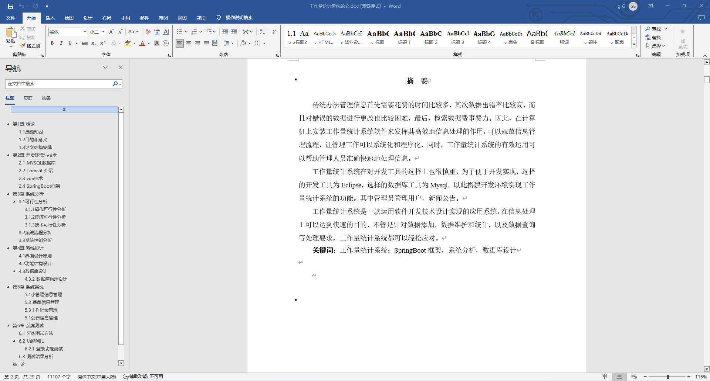
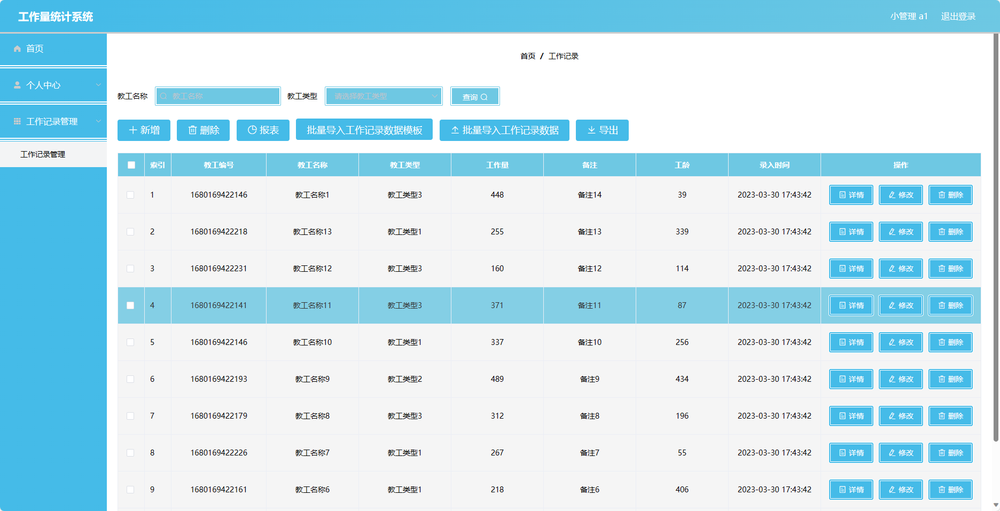
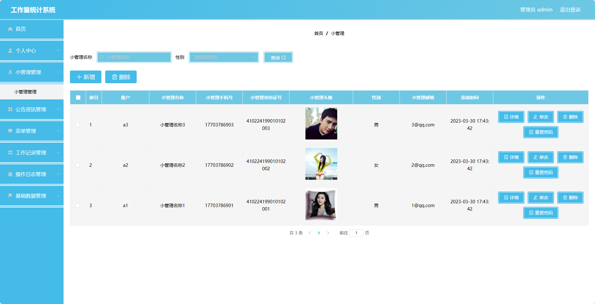
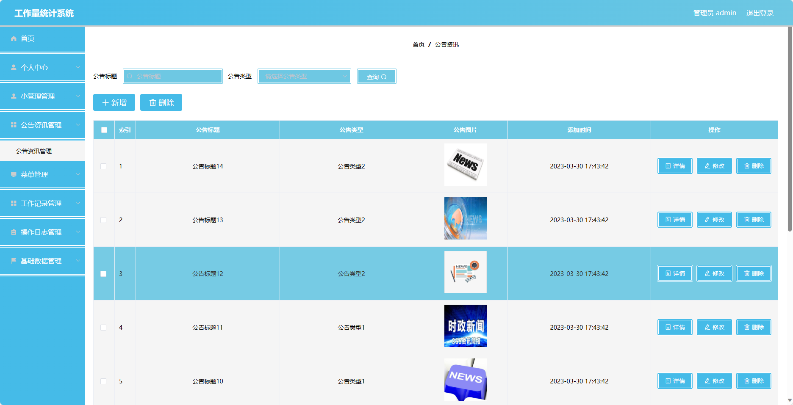
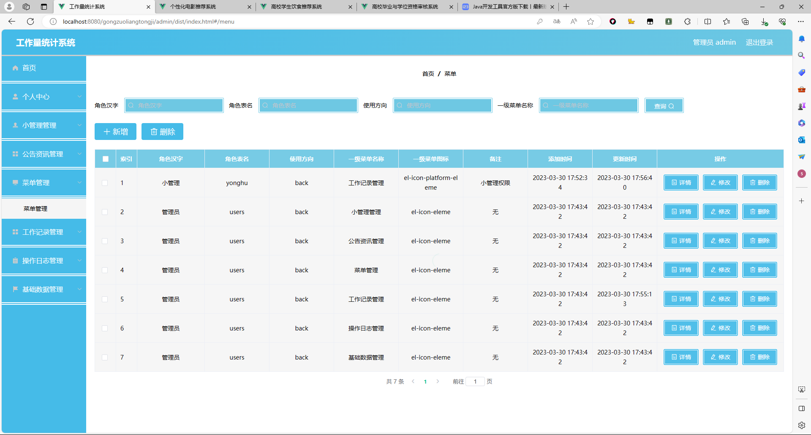
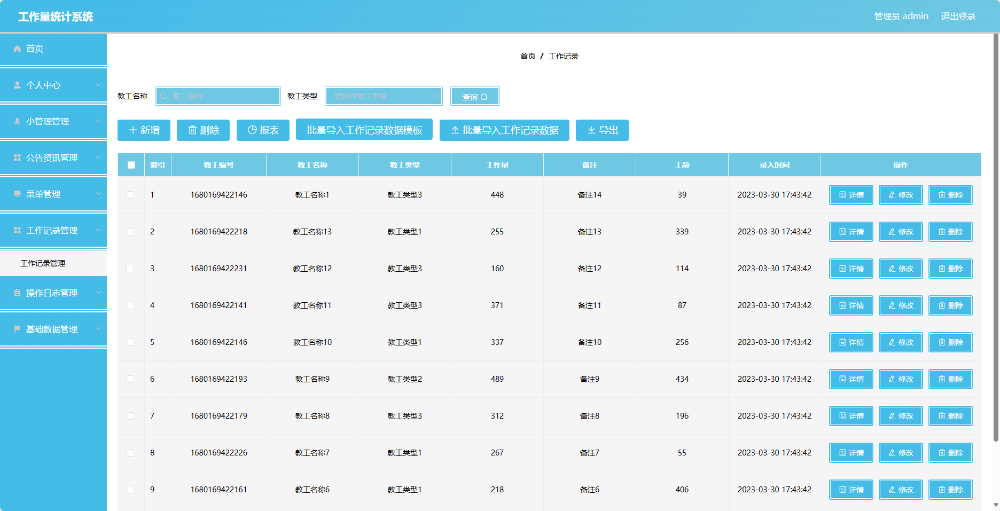
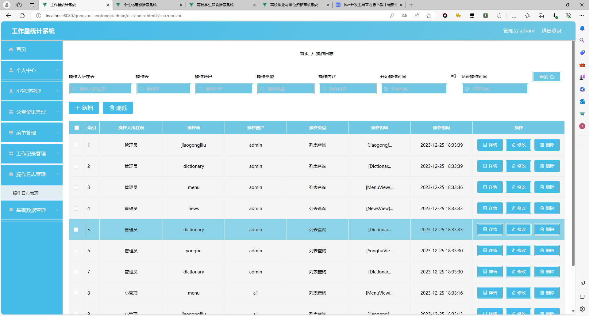
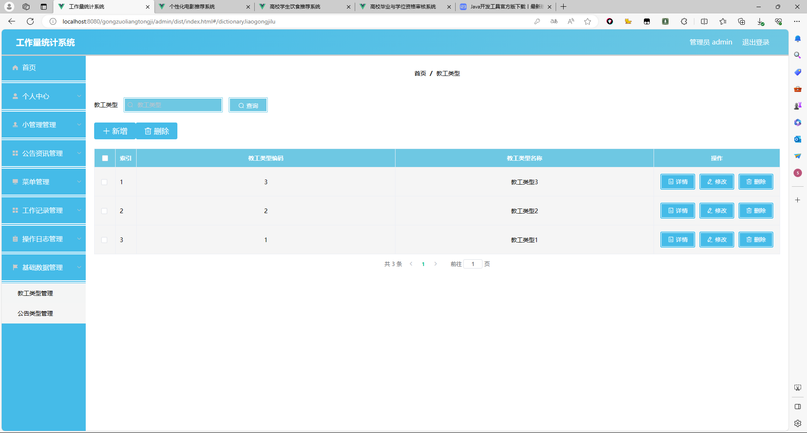
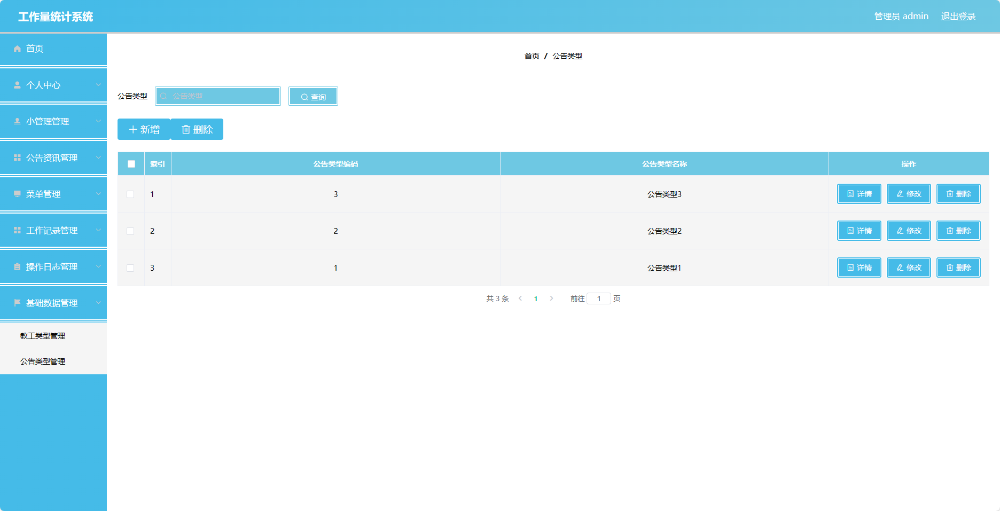

## 基于SpringBoot的工作量统计系统(程序+报告)

###  获取sql数据库文件: 从戎源码网 (https://armycodes.com/) QQ: 386869957 QQ群: 377586148
###  所有系统地址: (https://github.com/YuLin-Coder/AllProjectCatalog) 
###  所有项目以及源代码本人均调试运行无问题 可支持远程安装部署调试、定制修改、代码讲解

## 项目介绍
基于SpringBoot的工作量统计系统，系统包含两种角色：管理员、用户,主要功能如下。

### 【管理员】:
- 个人中心：管理管理员的个人信息，包括修改密码等操作。
- 小管理管理：管理员可以管理小管理账号，包括添加、编辑和删除小管理账号等操作。
- 公告资讯管理：管理员可以发布和管理公告资讯，包括添加公告、编辑公告、删除公告等操作。
- 菜单管理：管理员可以管理系统菜单，包括添加、编辑和删除菜单等操作。
- 工作记录管理：管理员可以查看和统计用户的工作记录，包括按时间、按用户等条件进行筛选和统计。
- 操作日志管理：管理员可以查看系统的操作日志，包括用户登录、操作记录等信息。
- 基础数据管理：管理员可以管理系统的基础数据，如部门信息、员工信息等。

### 【前台】:
- 个人中心：用户可以管理个人信息，包括修改密码等操作。
- 工作记录管理：用户可以添加、编辑和查看自己的工作记录，记录工作内容、时间等信息。

## 项目技术
- 编程语言：Java
- 数据库：MySQL
- 项目管理工具：Maven
- 前端技术：HTML、CSS、JavaScript、Jquery、Vue
- 后端技术：Spring、SpringMVC、MyBatis

## 运行环境
- JDK版本：JDK1.8及以上
- 开发工具：IDEA、Ecplise、Myecplise都可以
- 数据库: MySQL5.7及以上
- Maven：maven3.0及以上
- Node：14.14.0及以上

## 运行截图

